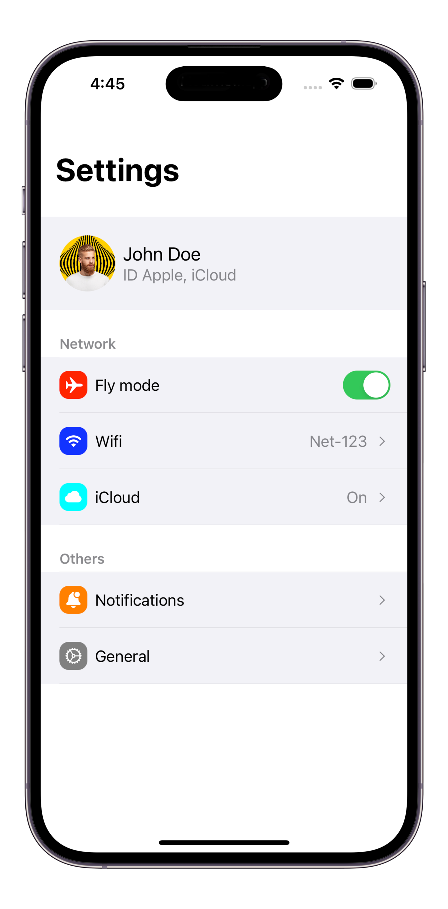

# SwiftyTableView
Use TableViews like in SwiftUI

```swift
ListViewController {
    UserCellController()
    
    SettingSectionController(title: "Network") {
        ToggleCellController(model: .flyMode)
        SettingCellController(model: .wifi)
        SettingCellController(model: .cloud)
    }
    
    SettingSectionController(title: "Others") {
        SettingCellController(model: .notifications)
        SettingCellController(model: .general)
    }
}
.navigationTitle("Settings")
```


